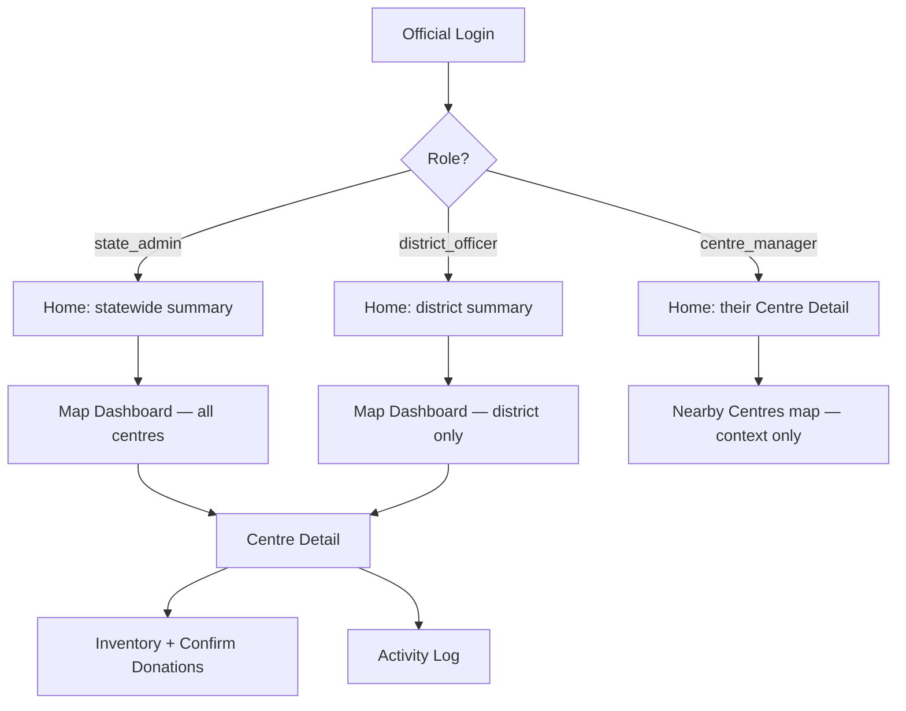

# Anbaram — Official Mobile App: MVP Scope & Build Plan
### Continuation of *Anbaram_Architecture_and_Build_Plan.md*

Scope for this pass: the **government official app, as a native mobile build** (not web), using **Google Maps**. The web dashboard (original Phase 4–5) is paused, not cancelled — the same `anbaram-app` codebase can grow a web target later. The donor/beneficiary flows (original Phase 6–7) are deferred until officials have something to receive donations into.

---

## 1. Feature additions worth folding into this MVP

An official-only app changes the priority list. A few things that weren't urgent for a donor/beneficiary demo become essential the moment a real official is standing in a warehouse with a patchy signal, trying to log 40 donated items before lunch.

| Feature | Why it matters here | Recommendation |
|---|---|---|
| **Role hierarchy** (state admin / district officer / centre manager) | A centre manager only cares about *their* centre; a state admin needs the whole map. One flat "official" role forces bad UX on one of them. | **Add to MVP** — cheap now, painful to retrofit |
| **Push notifications** (critical stock, new need matched) | Officials won't have the app open all day. Without push, a "critical" alert is invisible until someone happens to check. | **Add to MVP** |
| **Photo proof on donation confirmation** | A government platform handling public donations needs an audit trail beyond "official clicked confirm." A photo of the received goods is cheap insurance and builds public trust. | **Add to MVP** |
| **Offline queue for stock updates** | Many collection centres (schools, panchayat offices, rural community halls) will have unreliable connectivity. If the app hard-fails offline, officials will stop using it. | **Add to MVP**, kept deliberately simple (see below) |
| **Activity log viewer** (who changed what, when) | You already log this server-side (`activity_log`) — surfacing it in-app is nearly free and is the natural place to investigate discrepancies. | **Add to MVP**, one simple screen |
| QR-code donation confirmation | Faster than manual entry once the donor app exists, but there's no donor app yet to generate the code. | **Defer to v2** |
| Bulk inventory import (CSV) | Useful for onboarding a centre's existing stock in one go, but a manual first pass is fine for a handful of seeded centres. | **Defer to v2** |
| Reports export (PDF/CSV) | Valuable for compliance reporting up the chain, but not needed to prove the core loop works. | **Defer to v2** |
| SMS/WhatsApp alerts (in addition to push) | Reaches officials without smartphones/data, relevant at real statewide scale. | **Defer to v2** |
| Voice input for stock updates | Nice accessibility win for field staff, but adds real complexity for uncertain payoff at MVP stage. | **Defer / evaluate later** |
| Geofenced check-in before stock edits | Prevents an official from updating stock while not physically at the centre — a genuine anti-fraud feature for a government app. | **Defer**, worth revisiting before wide rollout |

---

## 2. Role model (new)



`centre_manager` skips the map entirely on login — no reason to make someone managing one centre navigate a statewide map to reach it.

---

## 3. Backend additions (Antigravity prompt — `anbaram-backend`)

```
Extend anbaram-backend for the Official Mobile App MVP:

1. Role hierarchy: update the `officials` table role field to one of
   state_admin | district_officer | centre_manager. Add `assigned_district`
   (nullable, for district_officer) and `assigned_centre_id` FK (nullable,
   for centre_manager) columns. Update the JWT payload to include role +
   assignment. Update GET /centres and GET /admin/needs-overview to scope
   results server-side: state_admin sees all, district_officer sees only
   their district, centre_manager sees only their one centre.

2. Push notifications via Firebase Cloud Messaging:
   - POST /officials/me/device-token — register/update an FCM device token
   - Add table fcm_device_tokens(official_id, token, updated_at)
   - Trigger a push when a centre_inventory item crosses below
     threshold_low (send to that centre's manager + their district_officer),
     and when a need_request is newly matched to a centre (send to that
     centre's manager)

3. Donation proof photos:
   - POST /donations/{id}/photo-upload-url — returns an S3 presigned PUT URL
   - POST /donations/{id}/confirm accepts an optional `photo_key` and stores
     it on the donation record

4. Activity log read endpoint:
   - GET /centres/{id}/activity-log — paginated, most recent first, scoped
     by the same role rules as above

Deliverable: a centre_manager's JWT only returns their own centre from
GET /centres; a device token registers successfully; confirming a donation
with a photo stores the S3 key; GET /centres/{id}/activity-log returns a
readable trail of recent stock changes.
```

---

## 4. Phased build plan — Official Mobile App (`anbaram-app`)

Each block is a self-contained Antigravity prompt, in order. OA-1 through OA-6.

### OA-1 — Mobile Foundation & Google Maps Setup

```
Configure anbaram-app for the official-facing mobile build (Android + iOS
targets; the web dashboard target from the earlier plan is paused for now).

1. Add google_maps_flutter to pubspec.yaml. Set up Android
   (android/app/src/main/AndroidManifest.xml meta-data API key placeholder)
   and iOS (AppDelegate.swift / Info.plist API key placeholder) configuration.
   Add a README note listing the manual steps the user must do in Google
   Cloud Console: enable "Maps SDK for Android" + "Maps SDK for iOS", create
   an API key, and restrict it by app bundle ID / SHA-1 fingerprint.
2. Add flutter_secure_storage for the JWT, and connectivity_plus for network
   status detection (used later for offline support).
3. Build the navigation shell: SplashScreen → checks stored JWT → LoginScreen
   or HomeScreen. Reuse lib/theme/app_theme.dart from the original Phase 1.
4. LoginScreen: email/password form in the app theme, calls
   POST /auth/official/login, stores JWT + decoded role/assignment securely.

Deliverable: app builds and runs on an Android emulator and iOS simulator, a
seeded official can log in and land on a placeholder Home screen, and the map
SDK keys are wired up (the map itself comes in OA-3).
```

### OA-2 — Role-Based Home

```
Build the role-aware Home screen in anbaram-app.

On login, read the official's role from the decoded JWT:
- state_admin / district_officer → Home shows a summary strip (today's
  donations count, centres in critical stock, pending need_requests in
  scope) plus "View Map" and "Needs Overview" buttons.
- centre_manager → Home opens directly into their Centre Detail view (built
  in OA-4), since they manage exactly one centre; still offer a small
  "Nearby Centres" map toggle for context.

Call GET /centres and GET /admin/needs-overview (already scoped by role on
the backend) to populate the summary counts.

Deliverable: logging in as each of the three seeded role types lands the
official on the correct, correctly-scoped home experience.
```

### OA-3 — Map Dashboard (Google Maps)

```
Build the Map Dashboard screen using the GoogleMap widget.

- Center on Tamil Nadu, one marker per centre from GET /centres (scoped to
  the official's role), colour-coded by stock_status (green/amber/red) using
  custom marker icons.
- Add marker clustering (google_maps_cluster_manager or fluster) since a
  state_admin may see 100+ centres at once.
- District filter dropdown (hidden entirely for centre_manager, who has only
  one centre), search bar by centre name, and a list/map toggle showing the
  same data as a scrollable list with status badges.
- Tapping a marker or list row opens Centre Detail (OA-4).

Deliverable: a state_admin sees all seeded centres clustered and colour-coded
on a live Google Map; a district_officer sees only their district's centres.
```

### OA-4 — Centre Detail: Inventory, Donation Confirmation & Activity Log

```
Build the Centre Detail screen, calling GET /centres/{id}.

1. Header: name, address, contact, status badge.
2. Inventory tab: item list with quantity, status chip, quick +/- stock
   adjustment buttons plus a manual-entry field, calling
   POST /centres/{id}/inventory on change.
3. Pending Donations tab: donations with status 'pledged' at this centre.
   Each row has "Confirm Receipt", opening a sheet to optionally capture a
   photo (image_picker) — upload via the presigned URL from
   POST /donations/{id}/photo-upload-url, then call
   POST /donations/{id}/confirm with the resulting photo_key.
4. Activity Log tab: paginated list from GET /centres/{id}/activity-log —
   who changed what item by how much, and when.
5. Stats section: donations this month, need_requests fulfilled, pending
   need_requests count (from the same GET /centres/{id} response).

Deliverable: an official can open their centre, adjust stock, confirm a
pending donation with an optional photo, and review the activity log — all
changes reflect immediately on return to the Map Dashboard.
```

### OA-5 — Needs Overview & Push Notifications

```
Add to anbaram-app:

1. Needs Overview screen (state_admin / district_officer only), calling
   GET /admin/needs-overview: list of pending need_requests in scope,
   urgency colour-coded, each row showing citizen, item, quantity, suggested
   nearest centre + distance, and a "Mark Fulfilled" action.
2. Firebase Cloud Messaging integration: request notification permission on
   first login, register the device token via
   POST /officials/me/device-token, handle foreground + background
   notifications for "new need matched to your centre" and "stock critical"
   alerts, tapping a notification deep-links to the relevant Centre Detail or
   Needs Overview screen.

Deliverable: marking a need fulfilled updates its status and disappears from
the list; triggering a critical-stock condition on the backend produces a
push notification on the device within a few seconds.
```

### OA-6 — Offline Support & Polish

```
Final polish pass for the official mobile MVP:

1. Offline queue: using connectivity_plus + a local store (Hive or
   sqflite), cache the last-loaded centre list and centre detail. If a stock
   update or donation confirmation is made while offline, queue it locally
   with a "pending sync" flag shown in the UI, and replay the queued API
   calls in order once connectivity returns — no new backend endpoint needed,
   this just replays the existing POST calls. Show a toast/snackbar
   summarising what synced.
2. Empty/error states styled per the theme, with English + Tamil copy (reuse
   lib/l10n from the original Phase 1) and a language toggle in Settings.
3. Accessibility pass: ≥4.5:1 text contrast, ≥44px tap targets, semantic
   labels on map markers and status chips.
4. Record a short walkthrough: a centre_manager logs in on a phone with wifi
   off → adjusts stock → reconnects → the change syncs and appears on a
   second device's Map Dashboard; a critical-stock push notification arrives
   on a district_officer's phone.

Deliverable: a field-ready official mobile app prototype, demoable end to
end, that a real government official could plausibly use during an actual
donation drive.
```

---

## 5. What's deliberately out of scope for now

- Web admin dashboard (original Phase 4–5) — paused, same codebase can add a web target later
- Donor and beneficiary flows (original Phase 6–7) — deferred until there's a working receiving side
- QR-code confirmation, CSV bulk import, PDF/CSV reports export, SMS/WhatsApp alerts, voice input, geofenced check-ins — all reasonable v2 candidates, listed in §1

Once this official app is demo-ready, the natural next step is OA-7 (not written yet): reconnect the donor flow from the original plan so a real pledge → confirm → stock-update loop can be shown end to end.
